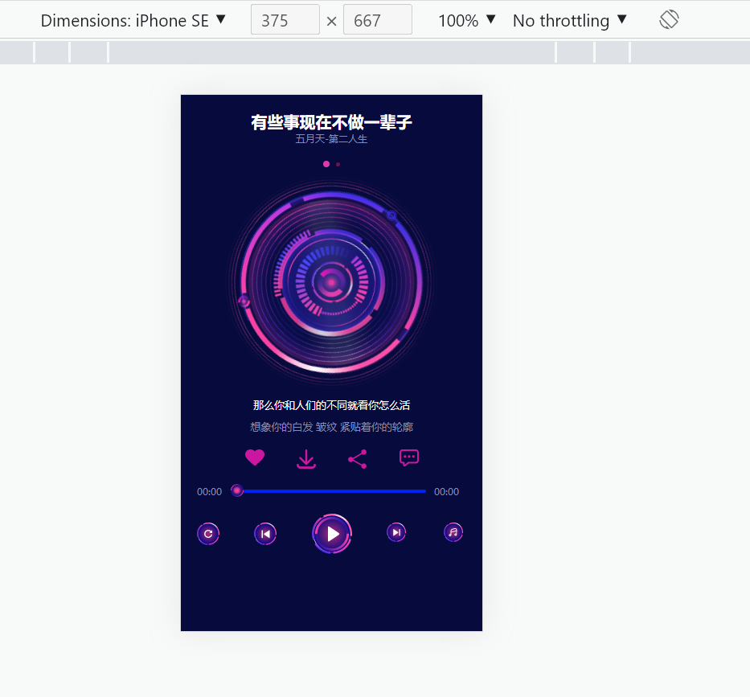
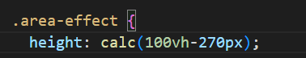
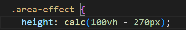

# 大坑

需求是适配小屏幕手机

要求把下面的元素固定在下面

遇到小屏幕时压缩中间动画的div空间

让按钮等播放元素能顺利出现

具体思路是把上下需要固定的元素的高度写死

动画的div是100vh 减掉 上下固定的元素px

然后用到calc()这个运算函数

一开始怎么写都不对，下面的元素会往上跑

控制台也显示calc()根本不能用

# 最后发现要写空格，否则是当负值而不是运算

